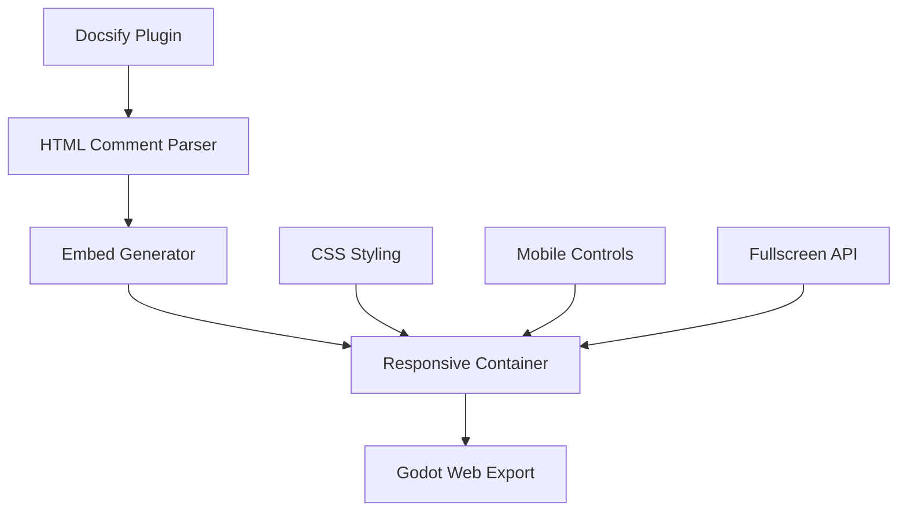

# Docsify Godot Embed Documentation

Welcome to the complete documentation for the docsify-godot-embed plugin.

## Quick Links

- [🚀 Getting Started](getting-started.md)
- [📖 API Reference](api-reference.md) 
- [🎨 Styling Guide](styling.md)
- [📱 Mobile Support](mobile.md)
- [🔧 Advanced Usage](advanced.md)
- [🧩 Examples](examples.md)
- [❓ FAQ](faq.md)

## What is docsify-godot-embed?

A powerful Docsify plugin that seamlessly integrates Godot web exports into your documentation. Perfect for:

- **Game Development Tutorials**: Interactive examples alongside explanations
- **API Documentation**: Live demos of features and functions  
- **Educational Content**: Hands-on learning with embedded projects
- **Portfolio Sites**: Showcase your Godot projects professionally

## Key Features

### 🎮 Multiple Embed Types
- **Project Browser**: Full project with scene selection
- **Specific Scenes**: Direct scene embedding
- **Path-Based**: Automatic scene resolution

### 📱 Mobile-First Design
- Touch-optimized controls
- Responsive layouts
- Mobile fullscreen modes
- Cross-platform compatibility

### ⚡ Performance Optimized
- Lazy loading iframes
- Efficient state management
- Minimal overhead
- Fast initialization

## Architecture Overview

## Live Demo

Experience the plugin in action:

<!-- embed-gdEmbed -->

## Next Steps

Ready to get started? Check out our [Getting Started Guide](getting-started.md) or explore the [API Reference](api-reference.md) for detailed implementation information.
